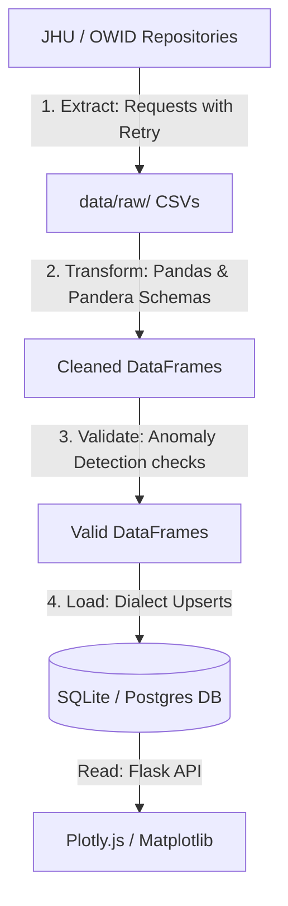

# Architecture Decision Log & System Design

This document details the architectural decisions, design choices, and technical trade-offs made for the COVID-19 Data Tracker.

---

## 1. Technical Stack Selection

### Web Framework: Flask vs. FastAPI/React vs. Streamlit
- **Choice**: **Flask** (Server-side rendering with HTML templates, dynamic charts with Plotly.js).
- **Rationale**:
  - *FastAPI + React*: Introduces build-step complexity (npm, webpack/vite, state management libraries) and is over-engineered for a simple single-page dashboard.
  - *Streamlit*: Highly opinionated, heavy on server CPU due to state-refresh reruns, and difficult to customize or secure (CSP headers, customized rate limits).
  - *Flask*: Offers clean MVC pattern, simple routing, excellent security integrations (like `Flask-Limiter` and CSP header controls), and supports standard HTML templates without external JS dependencies other than Plotly.js.
  - *Comments*: The code is heavily commented to ensure the structure, routing, and data flow are easy to read and understand.

### Database: SQLite vs. PostgreSQL
- **Choice**: **SQLite** (Default local file), with a built-in migration path to **PostgreSQL**.
- **Rationale**:
  - SQLite is zero-configuration, in-process, and highly portable. However, it locks the database during write transactions, preventing concurrent updates.
  - We use SQLAlchemy ORM with a dialect-agnostic schema, allowing it to seamlessly switch from SQLite to PostgreSQL via a single configuration variable (`DATABASE_URL`).
  - Idempotent upserts (`INSERT OR REPLACE` / `ON CONFLICT DO UPDATE`) are implemented using dialect-specific raw SQL blocks inside SQLAlchemy to handle bulk records safely.

### Visualization: Plotly.js vs. Server-side Rendering
- **Choice**: Hybrid (Interactive Plotly charts rendered client-side, static Matplotlib images rendered server-side).
- **Rationale**:
  - *Interactive Plots*: Transporting static high-res images over HTTP is slow and taxes backend RAM. Sending Plotly configurations as JSON and letting the client's browser (Plotly.js) render them is efficient and interactive.
  - *Static Plots*: Complex heatmaps or large lists (like the top 10 list or comparison grids) are generated dynamically as PNGs on the backend using Matplotlib and Seaborn, and cached using `Flask-Caching` to reduce DB load.

---

## 2. Data Flow & Lineage

The ETL pipeline runs sequentially as a single database transaction:

### Data Lineage
Every table in the database includes:
1. `ingested_at`: UTC timestamp of the ingestion run.
2. `source_file`: The specific file name (e.g. `confirmed.csv`) that produced the row.
This allows developers to track and debug data origin issues at any time.

---

## 3. Security Design

- **Rate Limiting**: Enforced via `Flask-Limiter` (IP-based, 5 per minute on `/api/refresh` to prevent denial-of-service, 50 per hour / 200 per day globally).
- **Input Sanitization**: Query parameters (`countries`, `dates`, `metrics`) are strictly parsed and matched against regular expressions (`COUNTRY_NAME_REGEX`, `DATE_REGEX`). Any suspicious characters (e.g., semicolons, quotation marks) abort with HTTP 400.
- **Content Security Policy (CSP)**: Strict headers restrict scripting only to self and trusted Plotly CDN sources.
